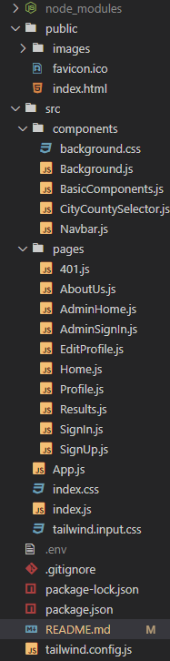

# Voting App - Frontend

This is the frontend for the Voting App, which allows users to register, vote, and view election details. It communicates with the backend API to provide a user-friendly interface for voting and profile management.

## Table of Contents

- [Features](#features)
- [Technologies](#technologies)
- [Prerequisites](#prerequisites)
- [Installation](#installation)
- [Usage](#usage)
- [Running the App](#running-the-app)
- [API Integration](#api-integration)
- [Folder Structure](#folder-structure)
- [License](#license)

## Features

- **User Authentication**: 
  - User sign-up and sign-in for creating accounts.
  
- **Voting**: 
  - View available elections and register for voting.
  - Cast votes in registered elections.
  
- **Profile Management**: 
  - View user profile details.
  
- **Admin Dashboard** (for admin users):
  - Admin sign-in and manage elections and candidates.

## Technologies

- **Frontend**: React.js (or Vue.js, depending on your preference)
- **CSS Framework**: Tailwind CSS
- **Charts and tables**: Chart JS
- **API Calls**: Axios (for making HTTP requests to the backend API)
- **Routing**: React Router (or Vue Router for Vue.js)

## Prerequisites

Before you begin, make sure you have the following installed:

- [Node.js](https://nodejs.org/) (version 14 or above)
- [npm](https://www.npmjs.com/) or [Yarn](https://yarnpkg.com/)
- A running instance of the backend API (see the backend [README](./backend/README.md) for more information).

